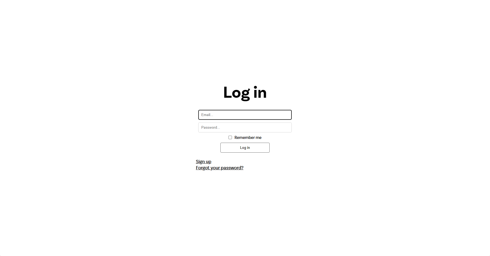

# MiniTODO - Ultra minimalistic TODO/checklist for everyday tasks and plans

This project is single page application built in Rails 7 and it's using turbo JS for appliying changes from DB to UI without refreshing

Minimalistic looks ↓

UI is user friendly and will be changed in near future for better looks.

###### This was created by Przemek Paciorek.
